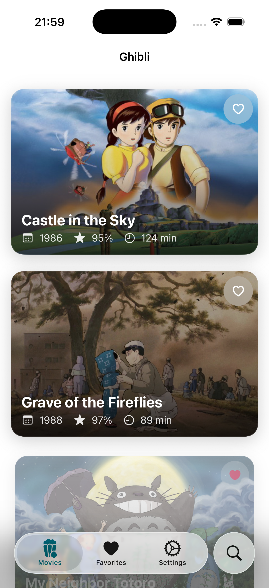
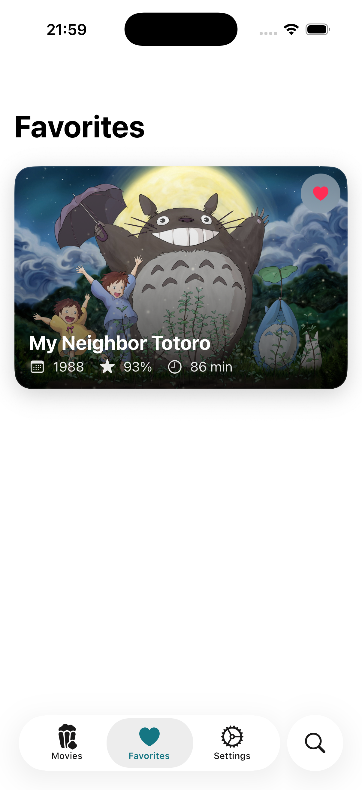
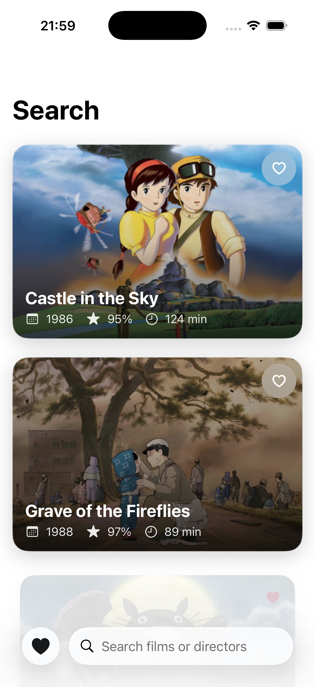

# Ghibli

A small SwiftUI app for browsing Studio Ghibli films, built to practise MVVM and modern Swift concurrency.

## Demo

| Movies | Favorites | Search |
| --- | --- | --- |
|  |  |  |

## Features

- Cinematic feed of films with cover art
- Film detail with characters loaded in parallel via task groups
- Favourites, persisted with `UserDefaults`
- Search across titles and directors
- Skeleton loading, empty and error states throughout

## Stack

- SwiftUI, iOS 26, Swift 6
- `@Observable` view models over a small networking layer
- Protocol-backed services (`GhibliService`, `FavoriteStorage`) with mocks for previews and tests
- Data from the [Studio Ghibli API](https://ghibliapi.vercel.app)

## Running

Open `GhibliSwiftUIApp/GhibliSwiftUIApp.xcodeproj` in Xcode and run the `GhibliSwiftUIApp` scheme.
